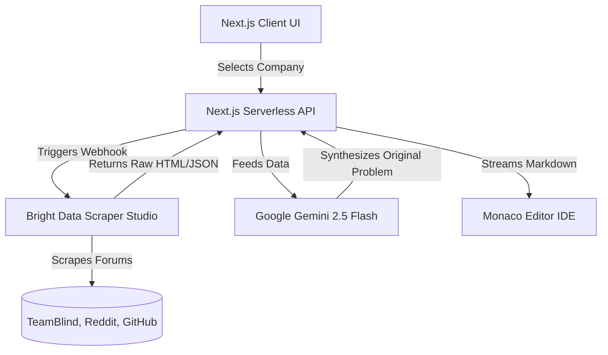

<div align="center">
  <br />
  <h1>🚀 Edith</h1>
  <p>
    <strong>Dynamic, AI-Powered Interview Preparation Platform</strong>
  </p>
  <p>
    Skip the static question bank. Practice against what companies are actually asking <i>this week</i>.
  </p>
  <br />
  <p>
    <a href="https://github.com/SshauryaaRocks19/edith/issues"></a>
    <a href="https://github.com/SshauryaaRocks19/edith/pulls"></a>
    <a href="https://nextjs.org/"></a>
    <a href="https://tailwindcss.com/"></a>
  </p>
</div>

---

## ⚡ The Problem with Static Banks

Every interview prep platform out there runs on the same broken loop: a candidate memorizes a question from a static bank, the company realizes it's leaked and changes the question, and the platform scrambles to catch up. Candidates end up pattern-matching instead of actually solving problems.

## 🎯 The Edith Solution

**Edith** skips the static question bank entirely. It is a dynamic interview preparation platform that uses real-time web scraping to tell you what companies are actually asking *today*. 

You tell Edith you have a Staff Engineer interview at Meta. It goes out and scrapes recent interview reports from forums like Blind, Reddit, and GitHub, identifies the underlying algorithmic patterns, and uses AI to synthesize a brand-new, original coding challenge in real-time. 

You don't get a leaked question; you get a custom-tailored environment to test your actual knowledge against the company's current hiring loop.

---

## 🏗️ Architecture

Edith is built on a highly modular, serverless architecture optimized for real-time AI generation and heavy scraping tasks.



### 💻 Tech Stack
- **Frontend Framework**: Next.js 16 (App Router)
- **Styling**: Tailwind CSS v4, Shadcn UI
- **Design System**: Custom Neo-Brutalist theme (solid black shadows, distinct borders, Public Sans typography)
- **Authentication**: Clerk (Next.js middleware integration, secure route protection)
- **Data Aggregation**: Bright Data Web Scraper APIs (Webhooks)
- **AI Synthesis Engine**: Google Gemini API (`gemini-2.5-flash`)
- **IDE Environment**: `@monaco-editor/react` (Embedded real-time code editor)

---

## 🕷️ The Two-Stage Scraper Architecture

Modern forums like TeamBlind and Reddit have complex dynamic DOMs, strict rate limits, and aggressive captchas. Traditional single-pass scraping fails instantly. 

Edith relies on a custom **Two-Stage Scraping Architecture** built on Bright Data to safely and reliably bypass these hurdles:

1. **Stage 1 (Interaction):** The scraper navigates to the target URLs, bypasses initial bot-protection, and explicitly waits for dynamic content to mount to the DOM (e.g., `wait("body")`).
2. **Stage 2 (Parser):** Once the DOM is stable, raw JavaScript injection (`document.querySelectorAll`) is used to surgically extract the relevant technical interview signals, cleaning the HTML and returning structured JSON.

This data is fed directly into our Gemini intent engine to identify overarching algorithmic trends, which are then synthesized into original markdown-formatted LeetCode-style problems.

---

## 🚀 Getting Started

### Prerequisites
- Node.js 18+
- A Google Gemini API Key
- A Clerk Authentication Account
- (Optional) Bright Data Account for live scraping

### 1. Clone the repository
```bash
git clone https://github.com/SshauryaaRocks19/edith.git
cd edith
```

### 2. Install dependencies
```bash
npm install
```

### 3. Environment Variables
Create a `.env.local` file in the root directory and add the following keys:
```env
# Clerk Authentication
NEXT_PUBLIC_CLERK_PUBLISHABLE_KEY=pk_test_...
CLERK_SECRET_KEY=sk_test_...

# Google Gemini API
GEMINI_API_KEY=your_gemini_api_key

# Bright Data Webhook Target (If using live scraping)
WEBHOOK_SECRET=optional_secure_secret
```

### 4. Run the Development Server
```bash
npm run dev
```
Navigate to [http://localhost:3000](http://localhost:3000) to view the application.

---

## 🗃️ Prebuilt Problem Sets

If you don't want to run the real-time scraper pipeline during local development, Edith comes with a CLI script to mass-generate highly relevant, mock technical questions for FAANG companies using the synthesis engine.

To populate the static problem sets cache (`src/lib/problem_sets.json`), run:
```bash
npx tsx -r dotenv/config scripts/generate_problem_sets.ts dotenv_config_path=.env.local
```

---

<div align="center">
  <p>Built with ❤️ for engineers preparing for their next big role.</p>
</div>
